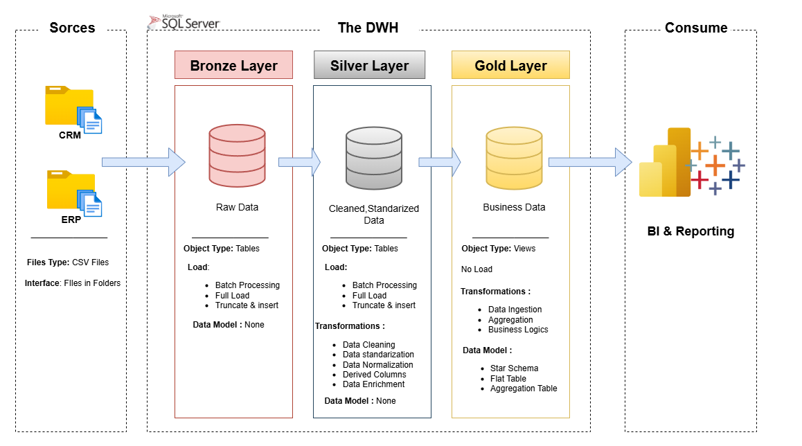
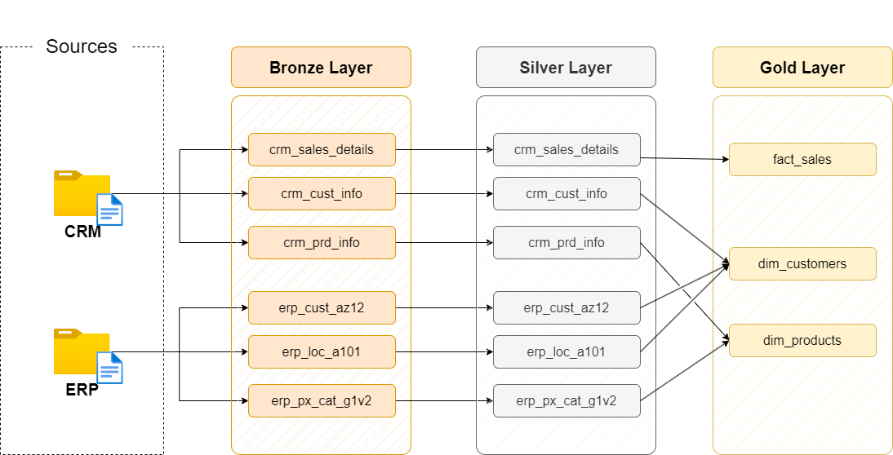
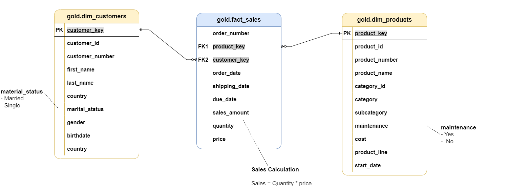

# 📊 Data Warehouse with ETL in SQL Server

This repository contains a full **Data Warehouse (DWH) project** built with **SQL Server** following the **Bronze → Silver → Gold** layered architecture.  
The project demonstrates how raw data from **CRM** and **ERP** systems can be ingested, cleaned, standardized, and transformed into **business-ready data models** for analytics & reporting.

---

##  Project Overview

The DWH is designed using a 3-layered approach:

### 🔹 Bronze Layer (Raw Data)
- Stores raw data directly from source systems (CRM & ERP).  
- Data is ingested **as-is** for traceability.  
- Operations:
  - Batch processing  
  - Full load / truncate & insert  

### 🔹 Silver Layer (Cleaned Data)
- Contains **cleaned and standardized** data.  
- Applied transformations:
  - Data cleaning  
  - Normalization & standardization  
  - Derived columns  
  - Data enrichment  

### 🔹 Gold Layer (Business Data)
- Provides **business-ready models** for analytics.  
- Designed as:
  - **Star Schema** (Fact & Dimension tables)  
  - Aggregation tables & business logic views  
- Used for **BI & Reporting** in Power BI / Tableau.  

---

## 🏗 Architecture



---

##  Data Flow



---

## 📂 Repository Structure

```

├── Docs/                  # Project documentation & diagrams
│   ├── Arch.png
│   ├── data\_flow\.png
│   ├── data\_integration.png
│   └── data\_model.png
│
├── SQL Scripts/           # ETL SQL scripts for each layer
│   ├── Bronze Layer/
│   │   ├── DDL\_Bronze.sql
│   │   └── Load FROM Source TO Bronze.sql
│   ├── Silver Layer/
│   │   ├── DDL\_Silver.sql
│   │   └── Load FROM Bronze TO Silver.sql
│   └── Gold Layer/
│       └── Gold\_Views.sql
│
├── Source Data/           #  input data (CSV files)
│   ├── CRM/
│   └── ERP/
│     
└── README.md

````

---

## ⚙ How to Run

1. Clone the repository:
   ```bash
   git clone https://github.com/keroloshany47/DWH_ETL_SQL.git
````

2. Set up a **SQL Server instance**.
3. Execute the scripts in order:

   * Bronze Layer → Silver Layer → Gold Layer.
4. Load the CSV files from the **Source Data** folder into your database.
5. Run the queries in `Gold_Views.sql` to generate **Fact & Dimension tables**.
6. Connect **Power BI / Tableau** to the Gold Layer views for reporting.

---

## 📊 Data Model




##  Contact 

* LinkedIn: [kerolos-hani-data](https://www.linkedin.com/in/kerolos-hani-data/)
* Email: [keroloshani474@gmail.com](mailto:keroloshani474@gmail.com)
